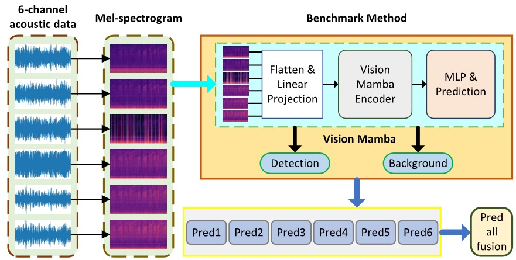

# MCAD-MM

This repo releases the data and code for the paper:

- MCAD-MM: A Benchmark Dataset and Method for Multi-Channel Acoustic Detection of Marine Mammals

## Overview

The MCAD-MM introduces a novel approach for the acoustic detection of marine mammals using deep learning. It establishes a comprehensive benchmark dataset and methodology that encompasses a wide range of marine mammal acoustic signals and ambient seawater noises. This provides essential data support and methodological guidance for advancing research in related fields.

<div align="center">
   
</div>


## Dataset Download
The MCAD-MM dataset can be downloaded via the [Baidu Netdisk](https://pan.baidu.com/s/1jKAl2qK_tYE77muw7c5lBw?pwd=IMTS) or [Hugging Face](https://huggingface.co/datasets/snzknight/MCAD-MM/resolve/main/dclde.zip?download=true)links.

## Preparation
For installation and data preparation instructions, please refer to [PREPARATION.md](docs/PREPARATION.md).

## Getting Started
To start using the benchmark method, follow the steps outlined in [GETTING_STARTED.md](docs/GETTING_STARTED.md).

## Model Zoo
The results are provided in [MODEL_ZOO.md](docs/MODEL_ZOO.md).

## License
The data and code in this repo are released under the [Apache 2.0 license](LICENSE).

## Acknowledgement
We would like to express our gratitude to the contributors of the following codebases and data products:

- [hustvl/Vim](https://github.com/hustvl/Vim)
- [facebookresearch/deit](https://github.com/facebookresearch/deit/tree/main)

<!-- 
## Citation
```
article
``` -->
